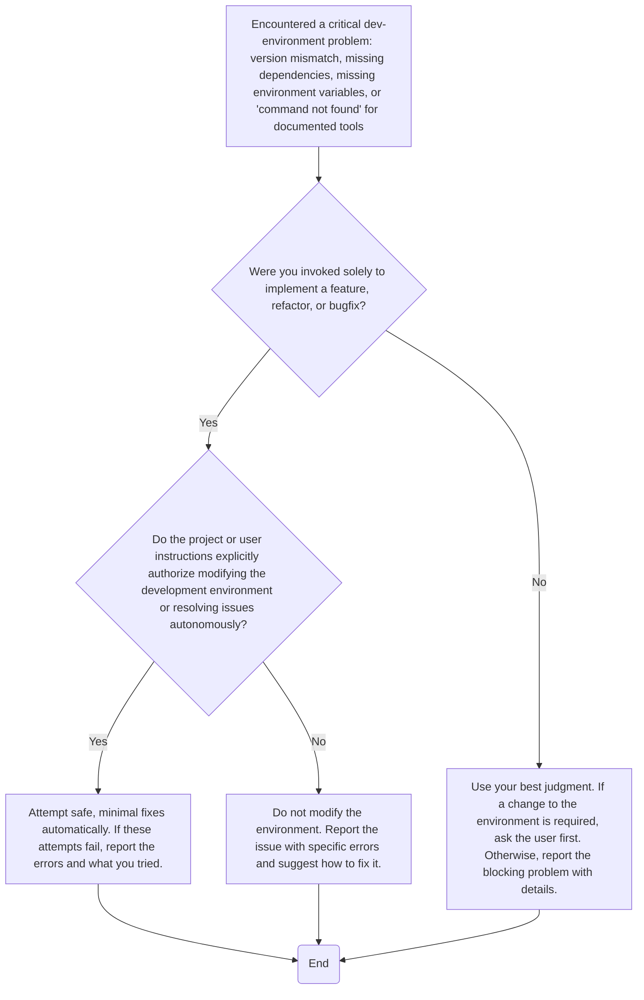

# Different custom Python linters and hooks for pre-commit.

## Project Structure

```text
src/
tests/
```

## Development Guidelines

- The repository contains multiple different linters.
- Each linter is independent and focuses on performing one task (e.g., only fixing function naming, or only fixing code comments).
- Linters must support being run via [pre-commit](https://pre-commit.com/).
- Performance is critical.

### Suggested Linter Architecture

Hybrid pipeline:

1. If possible, filter candidate files quickly using `ripgrep`, `ast-grep`, or `git grep`.
2. Parse and process the files using a Python parser or faster alternatives (`tree-sitter`, `ast-grep`, native Rust).

## Commands

### Python package and project manager

Use [`uv`](https://docs.astral.sh/uv/).

## **MUST** Rules

**REQUIRED:** Before committing or after making code changes, **ALWAYS** run:

```bash
uv run ruff check --fix .
uv run ruff format .
uv run mypy src/ tests/
npx prettier . --write --cache
taplo fmt pyproject.toml
uv run coverage run -m pytest
uv run coverage report
uv run strict-no-cover
```

When the task is completed, all code must conform to the following:

- all code has unit and integration tests;
- all edge cases are identified and tested;
- dead or unused code is removed (100% coverage is achieved);
- code that is an intentional guard from impossible cases or interface misuse and should not be tested is excluded from coverage report;

## Git

Commit your changes after completing the task.

### Git Commit Guidelines

**ALWAYS** use the [Conventional Commits](https://www.conventionalcommits.org/) standard for commit messages.

## Development Environment Troubleshooting



## **MUST NOT** Rules

- Do not implement before clarifying the missing information and understanding existing patterns.
- Never modify test expectations to bypass failures.
- Do not sacrifice using the latest Python features in favor of backward compatibility and supporting older versions.
- Do not suppress linter warnings (e.g., by adding `# noqa` or `# type: ignore` code comments) before trying to understand and fix the root cause.
