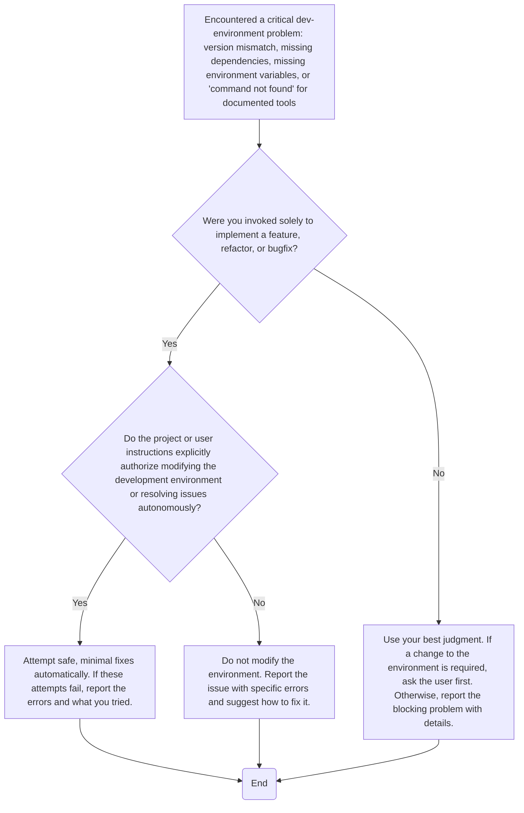

# Different custom Python linters and hooks for pre-commit.

## Project Structure

```text
src/
tests/
```

## Commands

### Python package and project manager

Use [`uv`](https://docs.astral.sh/uv/).

### Test

```bash
uv run pytest
```

## Code Style

### Code Quality: Always Format and Lint

**REQUIRED:** Before committing or after making code changes, **ALWAYS** run:

```bash
uv run ruff check --fix .
uv run ruff format .
uv run mypy src/
npx prettier . --write --cache
taplo fmt pyproject.toml
```

## Git

Commit your changes after completing the task.

### Git Commit Guidelines

**ALWAYS** use the [Conventional Commits](https://www.conventionalcommits.org/) standard for commit messages.

## Development Environment Troubleshooting



## **MUST NOT** Rules

- Do not implement before clarifying the missing information and understanding existing patterns.
- Never use `git commit --amend`, `git commit --no-verify`, `git add --all`, `git add .`, or `git add -A`.
- Never modify test expectations to bypass failures.
- Do not sacrifice using the latest Python features in favor of backward compatibility and supporting older versions.
- Do not suppress linter warnings (e.g., by adding `# noqa` or `# type: ignore` code comments) before trying to understand and fix the root cause.
